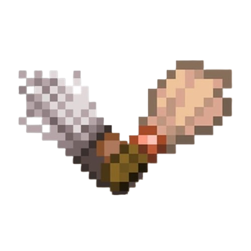
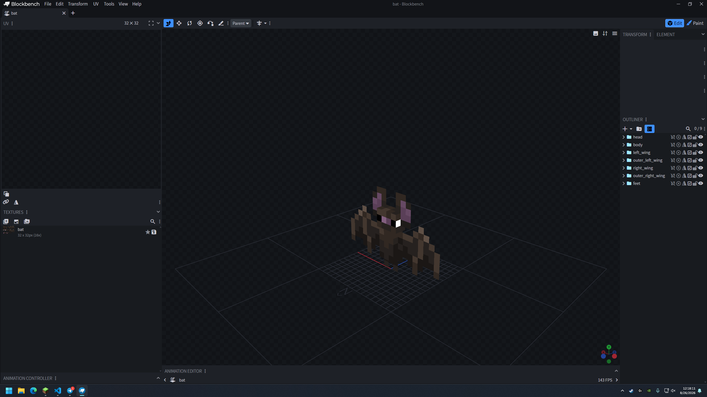
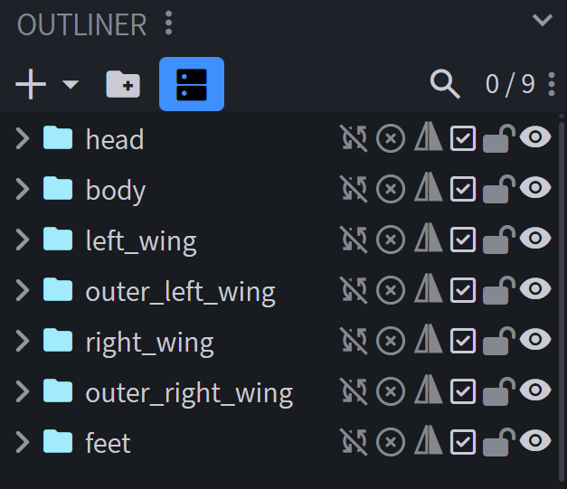
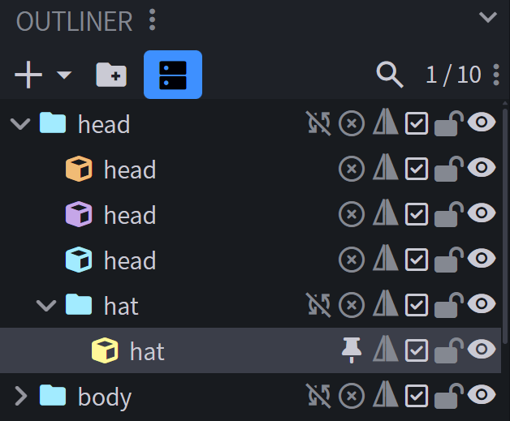
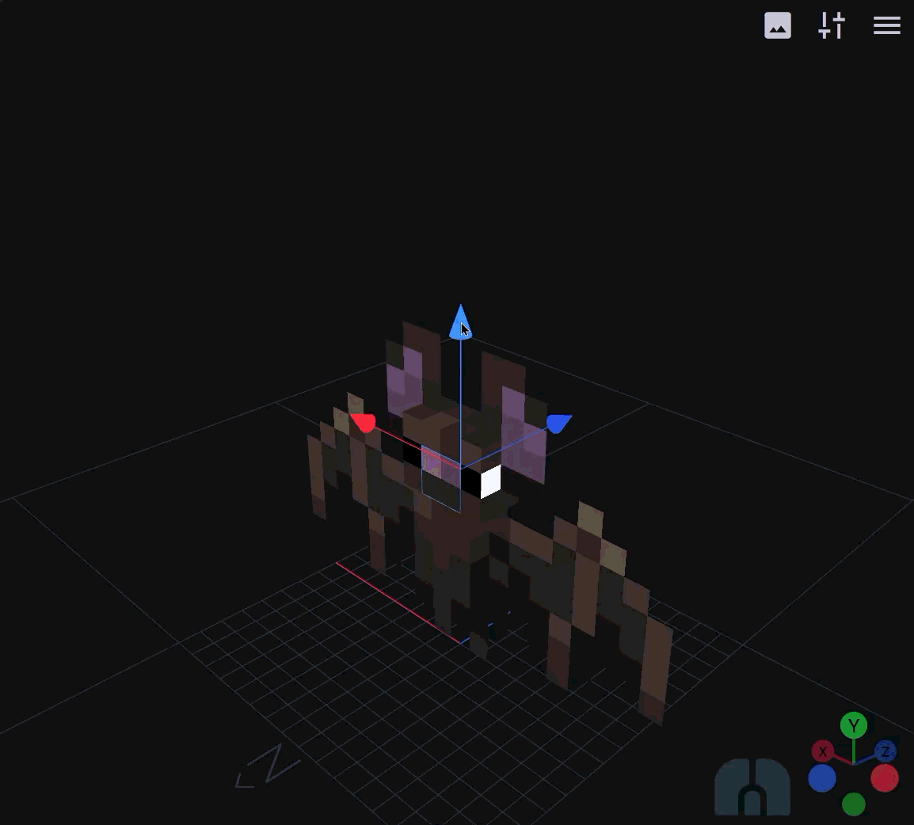
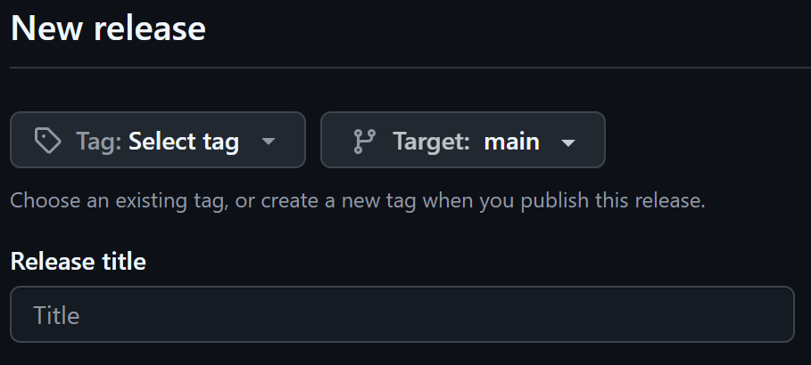

<div align="center">
  
</div>

## Resource pack

First of all, a resource pack is just a set of assets —textures, fonts, sounds, etc.— that replace their corresponding game files. This is the general structure a resource pack must follow:

```text
yourResourcePack/
├── pack.png
├── pack.mcmeta
└── assets/
    └── minecraft/
        ├── lang/
        │   └── en_us.json
        ├── optifine/
        │   ├── cem/
        │   │   └── entityName.jem
        │   └── random/
        │       └── entity/
        │           └── entityName/
        │               ├── entityName.properties
        │               └── entityName.png
        └── textures/
            ├── block/
            │   └── blockName.png
            └── item/
                └── itemName.png
```

You don't need all these files right away, throughout this tutorial you'll se how to add these step by step.

You can find the correct way to store a specific file (for example a chest texture or the Wither spawn sound) by obtaining the game files themselves (more on this below) or if you are using CreateTextures (for textures only duh), it will automatically place the files where they belong, all you have to do is copy that exact structure in the SMP resource pack folder.

If you want, you can download the SMP folder from this repository. It already has the necessary files for Minecraft to recognize this as a resource pack, these files are: `pack.mcmeta`, `pack.png` and the `assets` folder. **Remember these**.

### Obtaining game files

Sometimes you might need to check how Minecraft names certain textures and where they are stored, or you might just want to change the name of something in the game, like for example Emerald → Pacochelín. Here's how you can do it:

1. Locate your Minecraft `.jar` file and extract it.
   
    Open your launcher folder. For example, if you use Modrinth, the launcher is located at `C:\Users\user\AppData\Roaming\ModrinthApp`. You can also use **Windows + R** and type `%appdata%` and look for the `ModrinthApp` folder.
    Go to `meta/versions/yourVersion/<yourVersion>.jar` and extract it into some folder. 
    
    To extract the JAR file you have two options:

    1. Use a third-party tool like NanaZip, 7-Zip or WinRAR. I recommend NanaZip as it correctly works in the right-click context menu on Windows 11. Use **NanaZip** → **Extract to "yourVersion\ "**, which will create a folder with the extracted contents.

    2. Create a folder to store extracted files. Open the folder, and from there right-click to **Open in Terminal**.

        Type `jar -xvf "pathToYourJar\<yourVersion>.jar"`

        This will extract all contents in the current folder.
    
    For this whole tutorial we'll call this folder `MC_Resources`, as in original resources, so you should rename it to avoid confusion. Because this folder is for reference only, you can move it and even delete or modify files inside. The idea is to have the names and locations of Minecraft files, to then make your own. 
    
    **Do not modify the `.jar` file in any way, only the extracted files folder. These are a copy of your game files, so it won't affect Minecraft.**

2. Open the extracted files folder `MC_Resources`. What you can see in it is a bunch of game assets. Here are all the files you need and the correct folder paths where Minecraft will look. Should you make any changes to an item, block or entity, they have to be placed in the exact same path.

If for example you go to `MC_Resources/assets/minecraft/textures/entity/warden/`, you are actually seeing the in-game textures for the Warden entity and his stuff. You can copy these to make your own textures, and later, your own models.

> An entity

### To find and modify a texture for a specific item or entity

Now that you know how Minecraft reads assets, that is, their name and location, you can make your first texture pack.

As mentioned above, you can download the SMP folder from this repository to your Minecraft resource pack folder, it's ready to work with Minecraft 26.1.2, and rename the folder to whatever you want. 

You can delete all folders inside `assets/minecraft/` so that it is empty, and then add any files you want to modify in the game, following their correct folder path. Here are a couple examples of what you can do there:

#### 😊 Happy Warden
   
Find the original Warden texture file `warden.png` inside `MC_Resources`, open it an edit it in Paint. Draw a big smile on the guy.

You can now save that edited texture in its corresponding folder. **Remember to keep the original structure inside your texture pack** `<yourTexturePack>/assets/minecraft/textures/entity/warden/warden.png`. As of now, Minecraft will be able to recognize and use this resource pack. Hop in the game, enter **Resource Packs** and activate your Happy Warden. This works and it's great for quick testing, but ideally, you should zip the resource pack when you're ready to share. We'll talk about this in a while.

Right now, you can name the resource pack folder `HappyWarden`, and keep editing anything you need.

Notice how the relative path for `warden.png` starting from `assets`, is the same in both `MC_Resources` and `HappyWarden`. **This relative path always has to be an exact replica for any asset you modify**.

> Sometimes you might want to edit a block like a chest but doesn't appear anywhere. That's because a chest is not a block but an entity because Minecraft is weird. Some blocks that are not complete blocks are entities and some are not and it's a mess. You really have to look around sometimes.

#### To rename something

First, you should check what language Minecraft is set to. Even if it's just English, there's US English, Canadian English, Pirate English, so make sure which one it is.  

After that, you can head to your extracted JAR folder `MC_Resources/assets/minecraft/lang/en_us.json`, which is the file where all text in Minecraft resides if it's using US English. For example, you want to change the Wandering Trader's name to Peruvian. Open it in a text editor, use **Ctrl + F** to quickly look for `wandering` and once you find the line 

`"entity.minecraft.wandering_trader": "Wandering Trader",` 

you can set this to 

`"entity.minecraft.wandering_trader": "Peruvian",`. 

This will make the mob itself have that name in the game. You can do this with mobs, items (Pacochelín), GUI elements, titles, etc.  

When creating a resource pack, make sure everyone in the server will be able to see the change. If everyone is using English, but some use US English and some CA English, then you have to edit both `en_us.json` and `en_ca.json`. Internally the structure isn't the same for different languages, so remember to use **Ctrl + F**. And again, to save this to a resource pack, save it in the correct folder path, so `yourTexturePack/assets/minecraft/lang/en_us.json`, together with any other language files you might need to add.

### Finalizing a pack

Now you know how to:

* Find any game file you want to edit
* Edit some types of game files
* How to store them in a resource pack

To finalize a resource pack, you need to determine what Minecraft version/versions this pack is compatible with and zip it.

If you did decide to make the resource pack from a scratch, you will have to create the three main files for a resource pack: `pack.mcmeta`, `pack.png` and the `assets` folder you might have already created for the Happy Warden, if not, you should check how that goes.

The file `pack.mcmeta` is what determines which Minecraft versions the resource pack is made for. You can create any text file, change the extension from `.txt` to `.mcmeta`, edit it with any text editor like Windows Notepad and paste this:

```
{
  "pack": {
    "min_format": 84,
    "max_format": 84,
    "description": "Your pack description."
  }
}
```

As you would expect, the `min_format` and `max_format` values set the range of Minecraft versions that will support this pack. In this case `84` corresponds to Java versiones between **Java Edition 26.1 Pre-Release 1** and **Java Edition 26.1.2**.  

Refer to [Java Pack Format](https://minecraft.wiki/w/Pack_format#Java_Edition) for a complete version list and use the **Resource Pack Format** column. 

The `pack.png` is simply the thumbnail Minecraft will show in the **Resource Pack** menu, usually 64x64 pixels.

Once you are done editing and organizing everything, select all three files in the resource pack root folder: `pack.mcmeta`, `pack.png` and the `assets` folder, and zip them. You can now share this ZIP and it will immediately work as long as the Minecraft version is correct.

## Creating a custom entity model

Now that you know how resource packs work, you can start with custom models. Here are the main tools to create resource packs for Minecraft. Click the image to head to the website.

### Blockbench

<a href="https://blockbench.net/">
  
</a>

Blockbench allows to create models, skins, textures, titles and animations.

This program counts with many plugins to make whatever you want really. But to create custom models for mobs or even specific mobs with a nametag, you want to install CEM Template Loader. More on this in a while.

<br clear="left">

### CreateTextures

<a href="https://createtextures.com/">
  
</a>

Use CreateTextures to quickly create skins or textures with Minecraft version templates.

Here you can just select the Minecraft version you're at and edit any item in the game using the texture editor.  

Also, totems! You can have your totems look like a mini-you, a 2D or 3D you. Click **Start Creating** → **Create Custom Totem**. Remember to check whether your skin is classic or slim. ✅

<br clear="left">

### Editing a model

Now, onto Blockbench. Here you can take any Minecraft entity and edit its 3D model and texture.

Open Blockbench, go to **File** → **Plugins**, search for CEM Template Loader and install it. 

Either on the new file window, or with **File** → **New**, scroll down to Loaders and you will find **CEM Template Loader**. Click it.  
Here you will find a bunch of different entities you can edit. Select one, load it and start editing.



<br>

To the right, you will see the **Outliner** tab, which contains every part of the entity. Minecraft will expect this exact folder setup.



<br>

You can add more parts to the model by selecting a part, adding a folder  with  and clicling the **+** button.

> As long as that new part is inside one of the base folder, it will work. If you add an extra part or folder outside any of the base folders, it won't work.



<br>

You can move the new part by dragging the gizmos (colored handles), if you double click, you can scale the part. Keep in mind this editor just creates blocks, you can move, scale and rotate them. The remaining process is texturing.



<br>


Once you are done modeling and texturing, you need to save the texture and the model in separate places. In your resource pack, create the following folders:

```
assets/
└── optifine/
    ├── cem/
    └── random/
        └── entity/
```

Inside the entity folder, you will create another folder with the name of the entity you modified. **Refer to your `MC_Resources/assets/minecraft/textures/` folder and find the name of the folder and the texture file of the entity you modified**. For example, if it's a bat, then create a folder named `bat`.

> For entities with variants, the folder is the name of the entity and it contains the different variant textures. For example, the `MC_Resources/assets/minecraft/textures/entity/wolf/` folder contains all textures for all types of wolves.

Now, in this entity folder, you need to create a properties file and save the texture from Blockbench. To do this, create a text file with the name of the entity and change its extension from `.txt` to `.properties`. Edit it with any text editor and paste this:

```
models.2=2
skins.2=<entityName2>

name.2=<inGameNametag>
```

So if you are making a custom bat model for any bats with the nametag "Archibald", `bat.properties` would look like this:

```
models.2=2
skins.2=bat2

name.2=Archibald
```

and save.

Next, save the texture from the left panel in Blockbench. You have to name it `<entityNameX.png.>`, where *X* is the identifier of that custom entity texture. So for "Archibald", you have to save it as `bat2.png`.

Notice how in `bat2.png` and inside of `bat.properties` everything is "2". This makes Minecraft link that modified model (models.2=2) to the modified texture (skins.2=bat2), and applies it to any bat with the nametag "Archibald". We will elaborate on this later. For now, you have finished this folder.

Return to Blockbench and delete the texture on the left panel. This will leave the model without a texture and displaying random colors. You can now save the model as a `.jem` file inside `optifine/cem/` with the entity name, but, **for some reason, for entities with variants, like for example a Skeleton Horse, the name has to be inverted.**. This means what while the texture would be saved as `horse_skeleton2.png` (as it also appears in `MC_Resources`), the model has to be saved as `skeleton_horse.jem`.

Your texture pack should look like this:

```
assets/
└── optifine/
    ├── cem/
    |   └── entityName.jem              ← Inverted if it has variants
    └── random/
        └── entity/
            ├── entityName.properties
            └── entityName2.png
```

> The SMP resource pack contains models for entities with variants. If at any point you have doubts, you can check the naming convention in that pack, both in `optifine/cem/` and `optifine/random/entity/`.

At this point, you can open Minecraft and check if it works by naming any entity you modified with the name inside that entity properties file.

🟨⬛🟨⬛🟨⬛🟨⬛🟨⬛

Work in progress...

🟨⬛🟨⬛🟨⬛🟨⬛🟨⬛

## Updating resource pack

Once you've finished modifying the server resource pack, you need to create a GitHub release by uploading the pack in a `.zip` file and provide a hash for said file. Here are the steps.

1. To create the ZIP file, remember to select all files inside the SMP folder (that is: assets, pack.mcmeta and pack.png), and zip them. **Do not zip the SMP folder**. When you open the ZIP, you want to see something like:
    
    ```text
    assets/
    pack.mcmeta
    pack.png
    ```
    
    and not
   
    ```text
    SMP/
    ├── assets/
    ├── pack.mcmeta
    └── pack.png
    ```
    
    This is important as the latter will cause Minecraft not to recognize it as a resource pack.

2. Place the ZIP in the same location as the SHA1_Calculator tool if it's not already there. Double click SHA1_Calculator.bat and it will automatically calculate and copy the hash to your clipboard. Close that window and paste that strange text in the SHA-1 field shown in the next step.

3. Go to the GitHub repository → **Releases** → **Draft a new release**. Here there are a few fields to fill.

    

    In the tag dropdown menu shown above, select **Create new tag**. This tag must be something like `v1.0.0` or `v2.3.4`. Write it exactly like this with no spaces.

    The **Release title** should be `SMP vX.Y.Z`.

    For **Release notes** you can copy and paste the text below. Fill it in and paste the hash you generated using SHA1_Calculator.bat in the **SHA-1** field.

    ```
    Describe any change or addition. 
    
    Minecraft version: 
    SHA-1: 
    ```

    This hash text is extremely important. It ensures your Minecraft client knows it has to update the resource pack.

    Below that, there's **Release label**. Make sure it's set to **Latest**

    Finally, **Publish Release**. After that, you should reach out to Andrei so he can refresh the resource pack on the server.

    You can also delete the ZIP from your computer, it is safely stored in GitHub.
